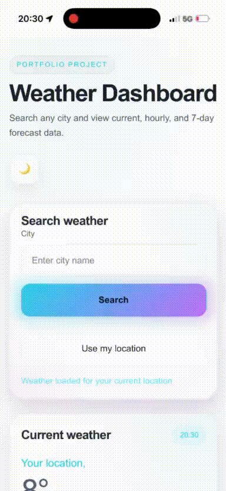

# Weather Dashboard

A responsive weather application built with Vite and vanilla JavaScript that
lets users search for a city and view current conditions, hourly forecast, and
7-day forecast data using the Open-Meteo API.

## Live Demo

[View the live project](https://mykytaburenok.github.io/Weather-Dashboard/)

## Live Preview

<p align="center">
  
</p>

## Repository

[View the source code](https://github.com/MykytaBurenok/Weather-Dashboard)

<p align="center">
  
</p>

## About the Project

This project was built as a portfolio piece to practice working with real API
data, modular JavaScript structure, and responsive UI design. It focuses on
turning a common tutorial-style idea into a more complete dashboard-style
application with clear layout, useful forecast sections, and a cleaner visual
presentation.

## Features

- Search weather by city name.
- View current weather conditions.
- See hourly forecast data.
- See 7-day forecast data.
- Use current location to load local weather.
- Toggle between themes.
- Responsive dashboard layout for desktop and mobile.

## Tech Stack

- HTML5
- CSS3
- JavaScript (ES Modules)
- Vite
- Open-Meteo API

## What I was working on?

- Fetching data from external APIs.
- Working with geocoding and weather forecast endpoints.
- Splitting app logic into small JavaScript modules.
- Rendering dynamic content into the DOM.
- Building a responsive UI with custom styling.
- Handling loading, success, and error states.

## Getting Started

### 1. Clone the repository

```bash
git clone https://github.com/MykytaBurenok/Weather-Dashboard.git
```

### 2. Go to the project folder

```bash
cd Weather-Dashboard
```

### 3. Install dependencies

```bash
npm install
```

### 4. Start the development server

```bash
npm run dev
```

## Future Improvements

- Add weather condition icons with better visual mapping.
- Improve current location handling with reverse geocoding.
- Add more weather details such as sunrise, sunset, or pressure.
- Save recent searches for faster reuse.
- Continue polishing UI details and interaction states.

## Why This Project Matters

For a frontend portfolio, this project helps demonstrate practical skills beyond
static layouts. It shows API integration, DOM rendering, modular structure,
responsiveness, and the ability to turn a simple concept into a more complete
user-facing application.

## Author

**Mykyta Burenok**  
Frontend Developer (Berlin)
